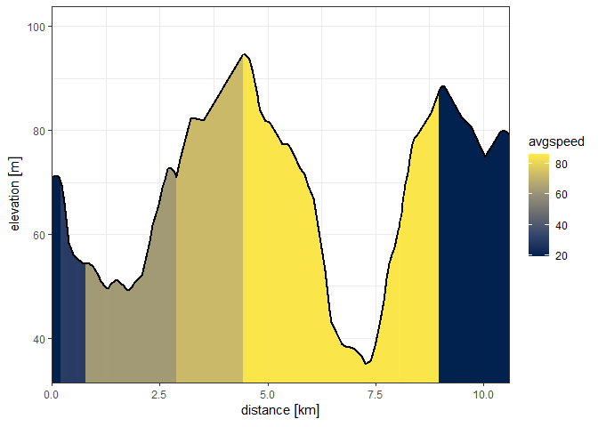

<!-- README.md is generated from README.Rmd. Please edit that file -->

# ORSRouting

# 

<!-- badges: start -->
[](https://lifecycle.r-lib.org/articles/stages.html#maturing)
[](https://cran.r-project.org/package=ORSRouting)
<!-- badges: end -->

The purpose of this package is to provide a comprehensive and convenient
R interface to local OpenRouteService instances in order to facilitate
batch routing. The package functions (so far) enable qualitative and
quantitative route computations, distance matrix generation, and
accessibility analyses (i.e. isochrones). Also included is a function
family to build local customized OpenRouteService instances from
scratch. While it is possible to use ORSRouting with the official web
API, requests will be very slow due to rate restrictions and therefore
not really suitable for larger scale analyses.

## Installation

You can install the development version of ORSRouting from
[GitHub](https://github.com/) with:

``` r
# install.packages("devtools")
devtools::install_github("JsLth/ORSRouting")
```

## Basic usage

Some basic functionalities using a public API key from
<https://openrouteservice.org>:

``` r
library(ORSRouting)

# Store API token in an environment variable and set up an instance object
# Sys.setenv(ORS_TOKEN = "<your ORS token>")
ors <- ors_instance(server = "api")
```

Generate random sample points:

``` r
rut_bbox <- sf::st_as_sfc(sf::st_bbox(c(
  xmin = -0.82,
  ymin = 52.52,
  xmax = -0.43,
  ymax = 52.76), crs = 4326))

set.seed(111)
sam <- ors_sample(20, poly = rut_bbox)
```

`ors_distances` returns only distances, durations and geometries - but
lots of them (i.e., row-wise):

``` r
ors_distances(sam[1:10, ], sam[11:20, ], geometry = TRUE, radiuses = -1)
#> Warning: ORS returned a warning for 2 routes: 3, 4
#> For a list of conditions, call `last_ors_conditions()`.
#> Simple feature collection with 10 features and 2 fields
#> Geometry type: LINESTRING
#> Dimension:     XY
#> Bounding box:  xmin: -0.832423 ymin: 52.53565 xmax: -0.443678 ymax: 52.76192
#> Geodetic CRS:  WGS 84
#> # A tibble: 10 × 3
#>    distance duration                                                    geometry
#>  *      [m]      [s]                                            <LINESTRING [°]>
#>  1   17684.    1005. (-0.585927 52.62225, -0.585971 52.62218, -0.585928 52.6220…
#>  2   14909     1028. (-0.534464 52.59134, -0.535761 52.59169, -0.535032 52.5924…
#>  3   16762.    1694. (-0.673213 52.60124, -0.673272 52.60109, -0.673465 52.6007…
#>  4   22279     1863. (-0.619596 52.61212, -0.618301 52.61173, -0.618139 52.6116…
#>  5   26410.    1740. (-0.676869 52.75829, -0.676512 52.75853, -0.676207 52.7587…
#>  6   21074     1298. (-0.658103 52.59416, -0.66118 52.59464, -0.661811 52.59471…
#>  7   23863.    1855. (-0.812994 52.67422, -0.813252 52.67402, -0.813767 52.6731…
#>  8   24108.    1424. (-0.613787 52.58954, -0.61045 52.59056, -0.610235 52.59062…
#>  9    6813.     459. (-0.650277 52.70877, -0.650583 52.7075, -0.651096 52.70481…
#> 10   23364.    2057. (-0.789158 52.66266, -0.789155 52.66255, -0.789236 52.6622…
```

`ors_matrix` also returns lots of distances, but many-to-many, not
row-wise:

``` r
ors_matrix(sam[1:10, ], sam[11:20, ], proximity_type = "duration")
#>          [,1]    [,2]    [,3]    [,4]    [,5]    [,6]    [,7]    [,8]    [,9]
#>  [1,] 1005.28  464.47 2000.60 2000.60  756.72 1298.59 1360.70 1177.51 1002.53
#>  [2,]  870.87 1027.49 2276.38 2276.38 1032.50 1697.86 1636.48 1379.39 1401.80
#>  [3,] 1234.55  976.50 1694.07 1694.07  450.19 1438.16 1119.55 1705.97  917.95
#>  [4,]  939.17  484.95 1863.44 1863.44  619.56 1155.32 1223.54 1265.46  859.26
#>  [5,] 1992.93 1390.66 2157.57 2157.57 1740.28 1224.99 2417.11 1411.76 1272.78
#>  [6,]  939.16  681.10 1553.78 1553.78  309.90 1297.87  979.25 1410.58  777.66
#>  [7,] 2246.22 1283.43  868.62  868.62 1178.26 1262.56 1855.09 1942.09  742.35
#>  [8,]  919.03  762.69 1847.89 1847.89  604.01 1433.05 1104.12 1423.46 1071.77
#>  [9,] 1815.77  776.33 1578.85 1578.85 1048.40  383.23 1725.23 1296.72  459.41
#> [10,] 2321.69 1391.43  864.61  864.61 1253.73 1370.57 1930.56 2050.09  850.36
#>         [,10]
#>  [1,] 1547.84
#>  [2,] 1727.83
#>  [3,] 2062.73
#>  [4,] 1571.19
#>  [5,] 1112.82
#>  [6,] 1767.34
#>  [7,] 1946.09
#>  [8,] 1771.89
#>  [9,]  945.23
#> [10,] 2056.77
```

`ors_shortest_distances` returns routes with the shortest distances from
each point in a dataset to all points in another dataset:

``` r
ors_shortest_distances(
  sam[1:2, ],
  sam[3:20, ],
  profile = "cycling-regular",
  radiuses = -1,
  progress = FALSE
)
#> Warning: For the following input rows, one or multiple routes could not be taken into
#> account: 1, 2
#> For a list of conditions, call `` last_ors_conditions(last = `2`) ``.
#>   point_number      route_type poi_number   distance   duration
#> 1            1 cycling-regular          2 3240.7 [m]  730.4 [s]
#> 2            2 cycling-regular         10 9155.4 [m] 2165.0 [s]
```

`ors_inspect` returns all requested information on a single route,
i.e. just one route but lots of data:

``` r
insp <- ors_inspect(sam[1, ], sam[2, ], radiuses = -1)
insp
#> Simple feature collection with 145 features and 5 fields
#> Geometry type: GEOMETRY
#> Dimension:     XY
#> Bounding box:  xmin: -0.602003 ymin: 52.59134 xmax: -0.52411 ymax: 52.62225
#> Geodetic CRS:  WGS 84
#> # A tibble: 145 × 6
#>    names       distance duration avgspeed elevation                     geometry
#>  * <chr>            [m]      [s]   [km/h]       [m]             <LINESTRING [°]>
#>  1 <NA>            8.64     1.58     19.7      70.6 (-0.585927 52.62225, -0.585…
#>  2 <NA>           14.4      2.64     19.7      70.8 (-0.585971 52.62218, -0.585…
#>  3 <NA>           24.2      4.43     19.7      70.9 (-0.585928 52.62205, -0.585…
#>  4 <NA>           98.8     18.1      19.7      70.9 (-0.585859 52.62184, -0.585…
#>  5 <NA>           49.7      9.09     19.7      71   (-0.58591 52.62095, -0.5859…
#>  6 Ketton Road    64.1      7.7      30.0      69.4 (-0.585936 52.6205, -0.5850…
#>  7 Ketton Road   112.      13.4      30.0      65.9 (-0.585003 52.62039, -0.583…
#>  8 Ketton Road    96.4     11.6      30.0      58.2 (-0.583401 52.62013, -0.582…
#>  9 Ketton Road    34.4      4.13     30        56.1 (-0.582078 52.6198, -0.5816…
#> 10 Ketton Road     7.39     0.89     29.9      55.8 (-0.581606 52.61968, -0.581…
#> # … with 135 more rows
#> # ℹ Use `print(n = ...)` to see more rows
```

``` r
plot_section(insp)
#> Loading required namespace: ggplot2
```



`ors_accessibility` requests isochrones and, optionally, rasterizes them
to produce an accessibility raster:

``` r
library(terra)
#> terra 1.6.3

isochr <- ors_accessibility(sam[1, ], range = seq(100, 1000, 100), location_type = "destination", rasterize = TRUE)

terra::plot(isochr)
```


## Local instances

While `ORSRouting` can work with public API requests, it is primarily
designed to be used together with local instances. The `ors_instance`
family can be used to manage, control and build local ORS instances. The
following code would download the source code and an OSM extract of
Rutland, change the setup files and finally start a local Docker-powered
server:

``` r
ors <- ors_instance(dir = "~") %>%
  ors_extract("Rutland") %>%
  ors_config(profiles = c("car", "bike-regular", "walking")) %>%
  ors_settings(ports = NA, memory = 0.1, auto_deletion = FALSE) %>%
  ors_up()
```
