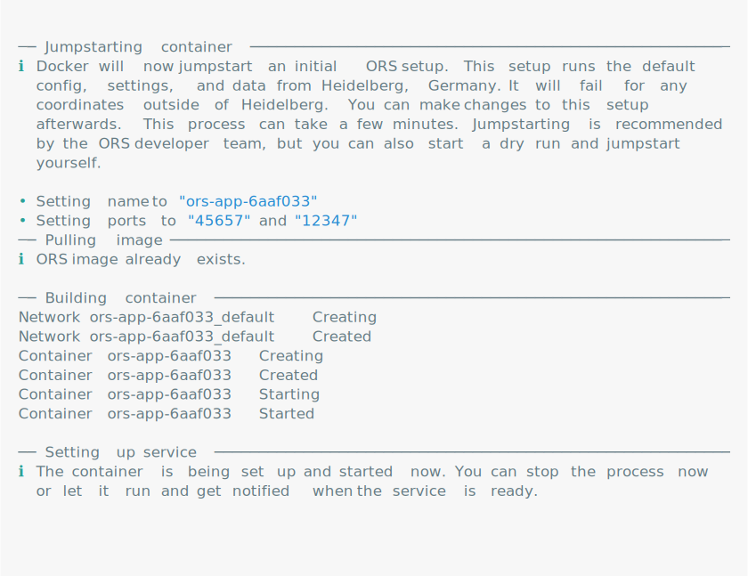
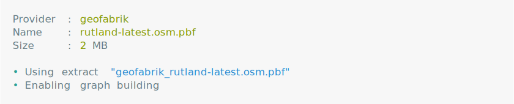
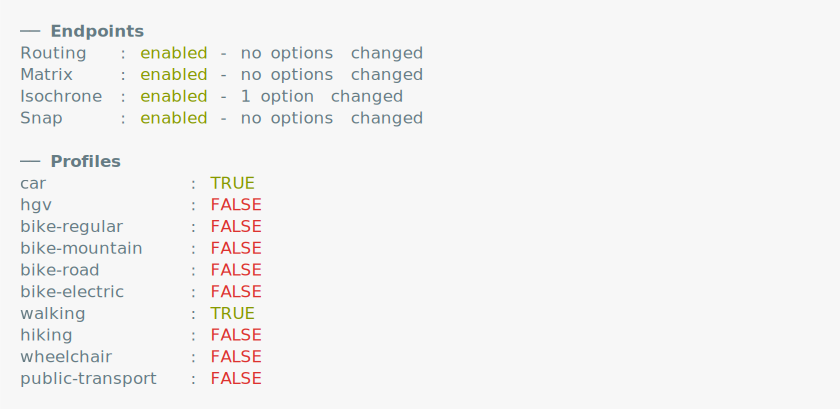
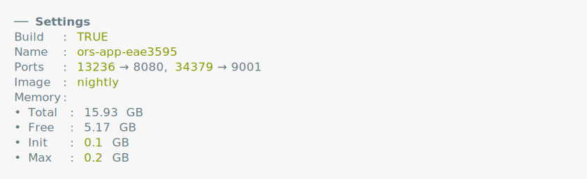

# Why do the routing functions not work off the shelf?

`rors` is powered by OpenRouteService (ORS) and as such depends on a running ORS instance. If you did not mount a working ORS instance first, all routing functions will throw an error. An OpenRouteService instance is a server that can be communicated with using a specified REST API. This can either be the [public API](https://api.openrouteservice.org), a local server or any kind of web server that runs ORS. Instances are controlled through the `ors_instance` functions and the ORS setup function family. The resulting `ors_instance` object is automatically attached to the session and detected by all routing functions in the package.

If you have no interest in setting up a local instance and just want to make quick routing requests, you can grab a free API key from the [official website](https://openrouteservice.org/) and chuck it into the `ORS_TOKEN` environment variable. It is best practice to do so without exposing the token to R code, e.g. through an [`.Renviron`](https://rstats.wtf/r-startup.html#renviron) file. After doing so, you can call `ors_instance` to attach the token to your session.


```r
# `server = "pub"` is short for https://api.openrouteservice.org/
public <- ors_instance(server = "pub")
public
```


```r
public$token
```


After doing this, all functions should be ready to use. Keep in mind though, that firing requests at the public API comes with lots of rate restrictions. For a simple request involving 100 routes you will wait upwards of two minutes as requests are throttled according to their rate restrictions. If you plan on working with larger datasets, if you are limited by server-side restrictions of the public API, or if you're handling sensitive data, it is strongly suggested that you set up a local instance. This vignette will cover the usage of `ors_instance` and family to construct and start a customized ORS instance using R.


# Setting up the service backend

In order to set up the ORS backend locally, we need three things:

- Docker
- An OpenStreetMap extract of the desired region
- A compose file telling Docker how to set up ORS

Of these, only Docker needs to be installed beforehand. `ors_instance` can verify the installation and start Docker, but it cannot assist in the installation process. You can get Docker from [here](https://docs.docker.com/get-docker/). Local ORS instances use Docker containers to host the service endpoints on a local server.

OpenStreetMap (OSM) extracts are regional data files from the OSM project. It contains spatial information relevant for routing such as streets, buildings and natural features. OSM extracts are distributed by providers such as [Geofabrik](https://download.geofabrik.de/) or [bbbike](https://extract.bbbike.org/). `rors` wraps the `osmextract` package to match, download, and process extract files.

Finally, a compose file is a file that instructs Docker how to create a container. The `ors_instance` function helps adjust this file, e.g. to change allocated memory or ports.

You can initialize a local ORS instance by passing a directory to `ors_instance`. The function then downloads a compose file from the official [ORS Github repository](https://github.com/GIScience/openrouteservice). It then proceeds to "jumpstart" ORS, i.e. it starts a default instance with default configurations and OSM data from Heidelberg, Germany. This is probably not what you want, but worry not, because you can make changes to this setup afterwards. Jumpstarting is deemed good practice by the ORS developer team and simplifies the rest of the setup.


```r
ors <- ors_instance(dir = ".", version = "7c77ae5")
```




Immediately after, we can take down the service to make changes to the ORS setup:


```r
ors$down()
```


The resulting `ors_instance` object is stored in a cache environment for the entire R session. All API functions automatically detect the currently mounted instance.


```r
get_instance()
```


The instance object already shows some important information when printed. We are dealing with a local instance on a localhost. The instance is "active" in that it is currently mounted to the session and it is "init" in that it was already built for the first time.

`ors` is an R6 object and provides multiple methods to set up a custom ORS instance. These methods can be divided into four categories:

- **Extract**: Methods and fields to interact with OSM extracts
- **Config**: Methods and fields to interact with the configuration
- **Settings**: Methods and fields to interact with the compose file
- **Docker**: Methods and fields to interact with Docker


## Changing the extract

If we wanted to learn more about the currently selected OSM extract, we can run:


```r
ors$extract
```


As you can see, we are currently running the default OSM file. If we wanted to get a new extract, we can run:


```r
ors$set_extract("Rutland", provider = "geofabrik")
```




This code runs `osmextract::oe_match` and `osmextract::oe_download` to download an extract of the British county Rutland. The extract is automatically added to the compose file, so you don't need to do anything else.


## Changing the configuration

ORS defines a `ors-config.yml` file inside the ORS directory that holds the configuration for the service. If you have ever used ORS before, chances are you have encountered errors that told you about server-side limits. The config file is the place where these limits are defined and where you can change them for your own setup.

The configuration especially includes the active routing profiles, profile-specific options and endpoint-specific options. Routing profiles are the transport modes used to do the routing with. The default is `driving-car`, but there are several other profiles you can choose from (refer to the [API playground](https://openrouteservice.org/dev/#/api-docs/v2/directions/{profile}/post)).

We can learn more about the currently active routing profiles:


```r
ors$config
```




As you can see, there is currently only one active profile: `driving-car`. To add more profiles, we can use the `$add_profiles` method. The method accepts either character values or objects of class `ors_profile` - or a combination of both. For quickly adding a new profile, you can simply refer to it by name.


```r
ors$add_profiles("walking", ors_profile("hiking"))
```


However, each routing profile comes with its own set of configurations. To have a better control over the configurations in each profile, we can create `ors_profile` objects. The following code creates a walking profile with the same defaults as above, but without taking into account elevation in its routing computations.


```r
ors_profile("walking", elevation = FALSE)
```


To remove a profile, you can refer to it by name:


```r
ors$rm_profiles("hiking")
```


Besides routing profiles, we can also change the configuration of entire endpoints. Endpoints include `directions`, `isochrones` and `matrix`. Each endpoint comes with its own limitations. For example, by default we can only create isochrones for 2 locations. To increase this limit, we can run:


```r
ors$set_endpoints(isochrone = list(maximum_locations = 100))
```


A full list of endpoint defaults set by ORS can be found in the [endpoint reference](https://giscience.github.io/openrouteservice/run-instance/configuration/ors/endpoints/). A full list of profiles and their specific configuration defaults can be found in the [profile reference](https://giscience.github.io/openrouteservice/run-instance/configuration/ors/engine/profiles).


## Changing the compose file

The final step before starting the setup is to check the container settings aka the `docker-compose.yml` file. You can check the current status of the compose file by printing:


```r
ors$compose
```




By default, ORS uses 1 GB of initial memory and 2 GB of maximum memory. This means that Docker starts allocating 1 GB of memory, but is only allowed to allocate a maximum of 2 GB. You can adjust these defaults to your needs using `$set_ram`. Usually, ORS requires about 2.5 times the size of the extract file for each routing profile as memory. You can either set the memory manually or let `$set_ram` make an educated guess:


```r
# Not passing anything tells `$set_ram` to freestyle
ors$set_ram()
```


```r
# Alternatively, pass values directly (as GB)
ors$set_ram(init = 0.1, max = 0.2)
```


```r
ors$compose$memory
#> NULL
```

Similarly, not passing anything to compose methods, makes them freestyle. `$set_name()` creates a random container name and `$set_port()` assigns a random port.


```r
ors$set_name()
```


```r
ors$compose$name
#> NULL
```


```r
ors$set_port()
```


```r
ors$compose$ports
#> NULL
```


## Docker

The final step of the ORS setup is to start the Docker container and, ultimately, the service. The Docker container can be controlled through a purpose-tailored high-level Docker interface that understands the following commands:

- Build and start a container (`$up()` / `docker-compose up -d`)
- Take a container down (`$down()` / `docker-compose down`)
- Start a container (`$start()` / `docker-compose start`)
- Stop a container (`$stop()` / `docker-compose stop`)
- Show logs (`$show_logs()` / `docker logs`)

The service can be started using the `$up()` method:


```r
ors$up()
```


By default, `$up()` blocks the console until the setup is done and gives out a visual and audible notification upon completion. If the setup fails, `$up()` immediately invokes an informative error. This is useful for short to moderately long setup times. However, especially for longer setups, this can be obtrusive. By passing `wait = FALSE`, the entire setup happens in a background process and you can keep using the console. There are two tools that enable you to monitor the setup progress nonetheless:

- `$show_logs()`: Prints the ORS logs to the console. Should the setup fail, this is the first place to look for errors. In fact, `$up(wait = TRUE)` also uses Docker logs to determine errors in the setup.
- `$is_ready()`: Shows whether the setup is done and ORS is ready to use. It accesses the `health` endpoint to determine whether the setup has completed without any errors. `$is_ready()` is a simple wrapper around `ors_ready()` which polls the currently mounted ORS instance.


When `ors_ready()` returns `TRUE`, you are officially ready to use the rest of the package functions!


# Manual changes

The methods of an ORS instance object cover only some settings and configurations. Many functionalities were deliberately left out to keep the number of methods neat and tidy. If you are missing some important feature, feel free to open a [Github issue](https://github.com/JsLth/rors/issues).

Yet, you can always make manual changes yourself. The methods introduced above are merely convenience wrappers that take care of some tedious tasks. Parsed versions of `ors-config.yml` and `docker-compose.yml` are readily accessible in the instance object:


```r
ors$config$parsed
#> NULL
```


```r
ors$compose$parsed
#> $services
#> $services$`ors-app`
#> $services$`ors-app`$container_name
#> [1] "new-name-123"
```

Both objects are lists, which can simply be modified:


```r
ors$compose$parsed$services$`ors-app`$container_name <- "new-name-123"
```

One caveat is that such simple assignments only change the state of the object, but not the state of the actual files. To synchronize the ORS file system, you have to `$update()` after making manual changes:


```r
ors$update()
#> Error in attr(compose$services$`ors-app`$ports, "quoted") <- TRUE: attempt to set an attribute on NULL
```

This command writes the current state of the parsed ORS files to disk. Conversely, if you make manual changes to one of the relevant ORS files, you can update the R instance object using:


```r
ors$update("self")
#> Error in file(file, "rt", encoding = fileEncoding): invalid 'description' argument
```

This command re-parses all ORS files. Again, it is advisable to make the majority of changes using the convenience wrappers as they automatically update and mount the instance object. Manually updating the instance is prone to errors which can be quite hard to spot and debug.


# Other methods

ORS instance objects contain some other important functions that didn't make it into this vignette. Among them are:

- `$is_built()` / `$is_running()`: Check whether a container is built and running. These are the two steps before a service is ready and are useful to monitor a container before the service is ready.
- `$is_mounted()`: Checks whether an instance is currently mounted to the session. If not the case, simply invoke one of the methods (e.g. `$update()`) to mount it.
- `$get_image()` / `$get_container()` Return some useful diagnostics about the image and container.
- `$get_status()`: Returns configurations and attributes of the ORS service (given that the service is ready).
- `$purge()`: Purges an ORS instance, i.e. takes down containers, deletes the ORS directory and cleans the instance object.
- `$rm_extract()`: Removes one or several extracts from the ORS directory.
- `$report()`: Prints a situation report of the ORS instance object.


